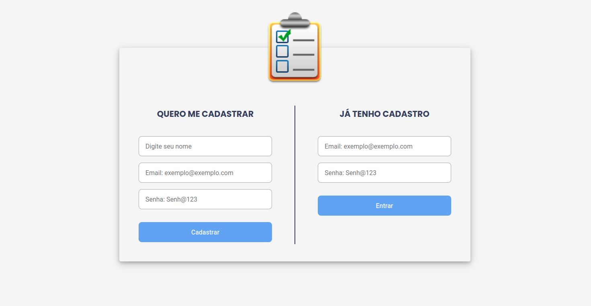
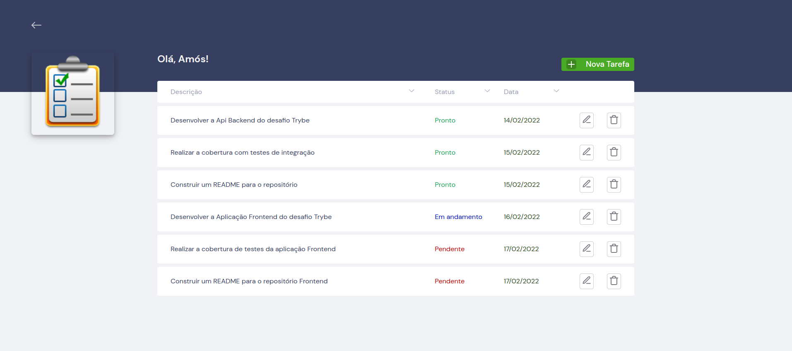
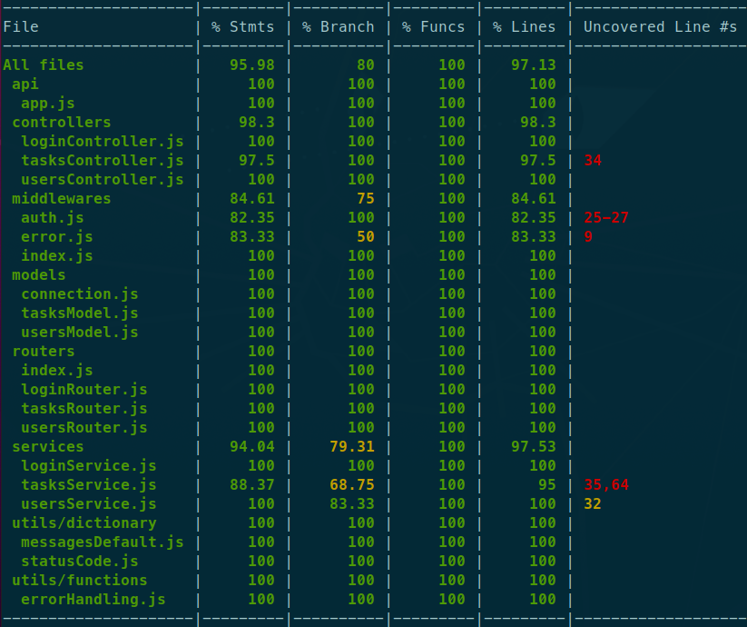

<div align="center">
    
  <h1>
    Boas vindas ao repositório do projeto "Tasks Manager - Backend"! 🚀
  </h1>
</div>

<p align="center">
  <a href="#tecnologias">Tecnologias</a>&nbsp;&nbsp;&nbsp;|&nbsp;&nbsp;&nbsp;
  <a href="#projeto">Projeto</a>&nbsp;&nbsp;&nbsp;|&nbsp;&nbsp;&nbsp;
  <a href="#instruções">Instruções</a>&nbsp;&nbsp;&nbsp;|&nbsp;&nbsp;&nbsp;
  <a href="#contato">Contato</a>
</p>

<br>

[**Layout obtido do Front**](https://tasksmanager-frontend.vercel.app/)

<div align="center">
    
    
</div>

<br>

---

<h1 id="tecnologias">Tecnologias ✅</h1>

<br>

Esse projeto foi desenvolvido com as seguintes tecnologias:

- JavaScript
- NodeJS
- Express
- MongoDB

<br>

---

<h1 id="projeto">Projeto ✅</h1>

<br>

Neste projeto é possivél que usuário possa:

- Fazer seu cadastro de usuário com nome, email e senha;

- Efetuar o login com o email e senha cadastrados;

- Visualizar a lista de tarefas contendo sua descrição, status e data;

- Ordernar tarefas pelo nome, status ou data;

- Adicionar, editar, e remover uma tarefa na lista;

- Fazer logout

Sobre o desenvolvimento:

- Utilização de token com JWT para autenticação de acesso ás rotas GET, POST, PUT e DELETE;

- Testes de integração com Mocha, Chai, Chai-http e Sinon;

- Conteplação de 97.13% na combertura dos testes de integração.

- Arquitetura seguindo os princípios SOLID, API REST e REST-FULL no formato MSC;

- Deploy na plataforma Heroku com processos do servidor geridos pelo PM2-RUNTIME.

- Banco de dados hospedado no [MongoDB Atlas](https://www.mongodb.com/) com servidor da AWS.

- Utilização do [ESLint](https://eslint.org/) para padronização de ecrita do código.

<br>

---

<h1 id="instruções">Instruções ✅</h1>

<br>

### Para instalação

1. Clone o repositório

- `git clone git@github.com:Amos-Rodrigues-Dev/tasksmanager-backend.git`.
  - Entre na pasta do repositório que você acabou de clonar:
  - `cd tasksmanager-backend.git`

2. Instale as dependências já contidas no arquivo `package.json`.

- `npm install`

3. Crie uma branch a partir da branch `main` conforme preferir.

4. Crie um arquivo `.env` para as variáveis de ambiente com a chave:

```ENV
 JWT_SECRET=senhaDeSuapreferencia
```

5. Descomente a linha **5** e comente a linha **4** do aquivo ./src/models/connection.js

```JS
- 4 const { MONGO_DB_URL } = process.env;
- 5 // const MONGO_DB_URL = 'mongodb://127.0.0.1:27017';
```

**👀 Observações importantes:**

- Para rodar o projeto é necessário possuir o [**MongoDB**](https://docs.mongodb.com/manual/tutorial/install-mongodb-on-ubuntu/) instalado e inicializado.
- Caso deseje pode rodar em imagem no container [**Docker**](https://docs.docker.com/engine/install/ubuntu/#os-requirements).

6. Rode os senguinte comando para iniciar a aplicação: 🎲

- Utilizando o PM2 com duas instancias:
  - `npm start`
- Com Nodemon:
  - `npm run dev`

### Para rodar os testes

- Todos os tetes:

  - `npm test`

- Arquivo específico contido no dirtório .test/integration/

  - `NAME=createTask npm test`

- Com sumario de combertura:

  - `npm run test:coverage`

  - **Utilizando com covarage o resultado esperado será parecido com este:**



<br>

---

<h1 id="contato">Contato ✅</h1>

<br>

<h1>
  
</h1>

<div> 
  <a href = "mailto:amos.adm.rh@gmail.com"></a>
  <a href="https://www.linkedin.com/in/amos-rodrigues-dev" target="_blank"></a> 
</div>

<br>

Espero que tenha curtido! 💜
